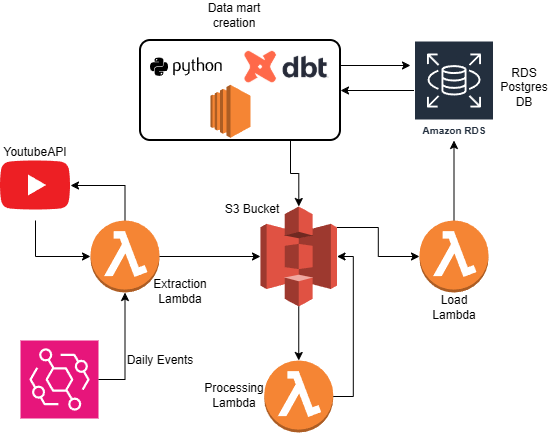
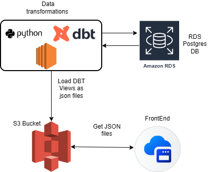

# YouTube Trending UY Data Pipeline

Event based ETL pipeline that tracks YouTube's daily trending videos in Uruguay, stores historical data, extract insights, and exposes it through a live dashboard.

**Live Demo →** [facug96.github.io/dbt-yt-trending](https://facug96.github.io/dbt-yt-trending)

---

## Architecture
#### Internal Architecture

#### External Architecture

## Stack

- **Ingestion**: AWS Lambda (Python), YouTube Data API v3
- **Storage**: AWS S3, AWS RDS (PostgreSQL)
- **Orchestration**: AWS EventBridge, S3 event triggers
- **Transformation**: dbt (views: `stg_youtube_snapshots`, `latest`, `previous`, `in`, `out`, `both`)
- **Export**: Python script (boto3, pg8000), AWS SSM Parameter Store for secrets
- **Frontend**: HTML/CSS/JS, GitHub Pages, S3 public bucket (CORS enabled)

---

## Data schema

Table: `youtube_snapshots`

| column | type | description |
|---|---|---|
| id | varchar | YouTube video ID |
| snippet_title | text | Video title |
| snippet_channeltitle | text | Channel name |
| snippet_publishedat | timestamptz | Video publish date |
| snippet_categoryid | integer | YouTube category |
| snippet_thumbnails_default_url | text | Thumbnail URL |
| statistics_viewcount | bigint | View count at snapshot time |
| statistics_likecount | bigint | Like count at snapshot time |
| statistics_commentcount | bigint | Comment count at snapshot time |
| snapshot_ts | timestamp | When the snapshot was taken |
| region_code | varchar | Region (UY) |
| rank | integer | Position in trending list |

---

## dbt models

| model | type | description |
|---|---|---|
| `stg_youtube_snapshots` | view | Base layer, reads raw table |
| `latest` | view | Most recent snapshot |
| `previous` | view | Second most recent snapshot |
| `in` | view | Videos that entered the top 5 |
| `out` | view | Videos that left the top 5 |
| `both` | view | Videos that stayed in the top 5 |

---

## Dashboard

The frontend fetches five static JSON files from S3 and renders three views:

- **Hoy** — current top 5 with thumbnails, channel, and view count
- **Movimientos** — what entered, left, or stayed vs the previous snapshot
- **Histórico** — all snapshots grouped by date
